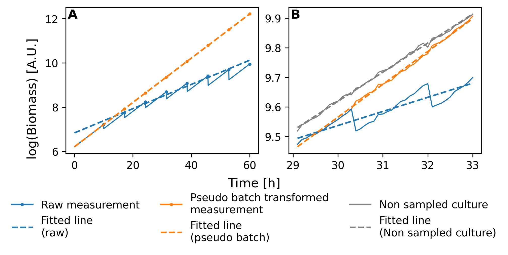

# Welcome to the Pseudobatch transformation repository
This repository holds the code for the Pseudobatch Python package, Excel-templates, the documentation, example datasets and the code required to reproduce simulations, analysis and figures in the article https://www.biorxiv.org/content/10.1101/2024.05.27.596043v2.


## What is this?
The Pseudobatch transformation is a method to transform data from fed-batch processes to ease analysis both through visual inspection and through statistical modelling. The transformation is especially useful when samples are drawn during the fed-batch fermentation.

A simple example is the following (simulated) fed-batch fermentation. During the fermentation we have simulated several samples. Typically samples are removed to have more comprehensive analysis through e.g. HPLC, transcriptomics, proteomics, metabolomics, Optical density (OD), etc. 

The grey line show the simulated biomass in mass units (not concentration). The biomass curve makes sudden drops because mass is removed samples are withdrawn. The blue point are biomass measurements at the sampling point e.g. OD measurements.


A typical analysis of such fermentation data is the estimate the growth rate. This is typically done through a log-linear model, i.e. first log-transforming the biomass measurements and the fit a linear model. If we fit a log-linear model to the raw growth data, we obtain the wrong estimate of the growth rate (blue line). It visually clear that the slope of the blue line is not the same as the slope of the grey line. However, if we first apply the Pseudobatch transformation, we remove the sudden drops in mass and now we obtain the correct growth rate from the log-linear model.



## How to use?
There are multiple ways to use the pseudobatch transformation. 

### Excel templates
Download the excel template from the [excel-pseudobatch folder](./excel-pseudobatch/) and follow the instructions in the template. **NB** the excel template can also be used to import data into Python (See [here](https://biosustain.github.io/pseudobatch/Tutorials/5%20-%20Importing%20data%20from%20Excel%20template.html)).

### Python
The Python package holds functions which apply the pseudobatch transformation to data either in the form of `Numpy` Arrays or `Pandas` dataframe. Please visit [our documentation]() to how to use the Python package.

## How to install?
The Pseudobatch Python package can be install through PYPI using pip. Most of the functionality can be installed simply by calling

```shell
pip install pseudobatch
```

The error propagation functionality requires installation of cmdstanpy and CmdStan. Please see the cmdstanpy documentation for how to install both cmdstanpy and CmdStan in your specific setup (https://mc-stan.org/cmdstanpy/installation.html). After successfully installing both proceed to install the remaining dependencies of the error propagation module through pip.

```shell
pip install pseudobatch[error_propagation]
```

Now the error propagation module is installed and ready to use. Note that the first time you import the error propagation module CmdStan will compile the Stan model this will take several minutes.

## How to cite
If you use the pseudobatch transformation please cite the preprint article until the peer reviewed article is published.

> Pseudo batch transformation: A novel method to correct for mass removal through sample withdrawal of fed-batch fermentations
> Viktor Hesselberg-Thomsen, Teddy Groves, Timothy McCubbin, Igor Marin de Mas, Ivan Martinez-Monge, Lars K Nielsen
> bioRxiv 2024.05.27.596043; doi: https://doi.org/10.1101/2024.05.27.596043

## How to reproduce the simulations, analysis and figures from the article?
The [article folder](./article/) holds the code which was used create the simulated datasets, to proof that the transformation works, analyse the error propagation and create the illustrations for the paper. 

### Docker container
To increase reproducibility we have provided a docker container. Inside this container all simulations and analysis can be reproduced. Instructions on how to download and use the docker container is found in the [article folder](./article/README.md).

## Building the documentation

Pseudobatch's documentation lives in the folder `docs`, written in Jupyter
notebooks and restructured text documents and built using
[Sphinx](https://www.sphinx-doc.org). 

The source files can be found in the folder `docs/source`.

In order to rebuild the documentation after editing, first make sure that you
have installed all the dependencies by running `pip install -e
.'[development]'` from the project root. Next, change directory to `docs` and
run the command `make html`. To view your changes run `open
build/html/index.html` or just click through to this file using your file
explorer.