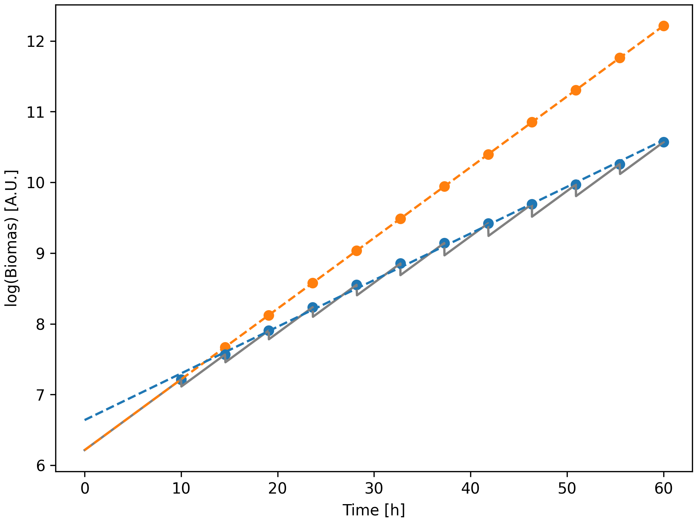

.. Pseudobatch documentation master file, created by
   sphinx-quickstart on Thu Mar 23 14:01:21 2023.
   You can adapt this file completely to your liking, but it should at least
   contain the root `toctree` directive.

Welcome to Pseudobatch's documentation!
=======================================
**Are you looking for the Excel template? See** `here <https://github.com/biosustain/pseudobatch/tree/main/excel-pseudobatch>`_

When conducting a fed-batch fermentation, one often collects samples during the process and uses these to estimate rates and yields. Unfortunately, when samples are collected the underlying mass evolution curve becomes discontinuous. This makes it difficult to estimate the rates and yields from the data. The pseudobatch package is a tool to transform concentration measurements from a fed-batch reactor into a space where the underlying mass evolution curve is continuous. This allows for easy estimation of rates and yields from the data and enables use of more advanced statistical models such as Gaussian process regression, splines estimation and dFBA.

In the following figure, a simulated exponential fed-batch process of substrate limited growth is shown (grey line). The growth rate is estimated using the measurements at the sampling points (blue dots and line). The measurements are then transformed into a pseudo-batch space (orange dots). The growth rate is estimated using the Pseudo-batch transformed data (orange line). The growth rate estimate using the Pseudo-batch transformed data is correct, while the growth rate estimate using the measurements at the sampling points is incorrect. This is also visually evident by the fact that the orange line has the same slope as the grey line, while the blue line has a different slope.

.. toctree::
   :maxdepth: 2
   :caption: Contents:

   install
   Quick start
   Tutorials/index
   api
   
Indices and tables
==================

* :ref:`genindex`
* :ref:`modindex`
* :ref:`search`
